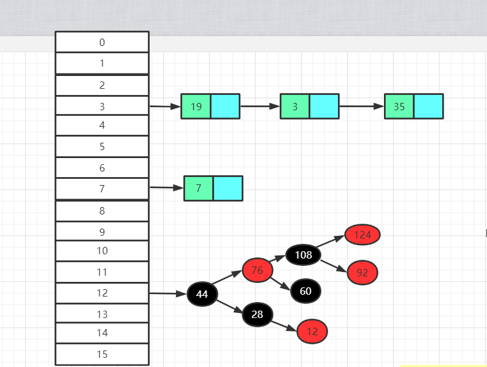
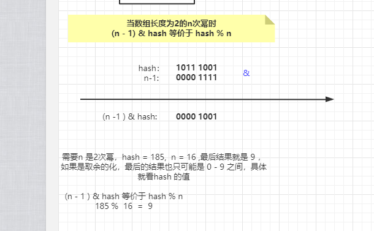
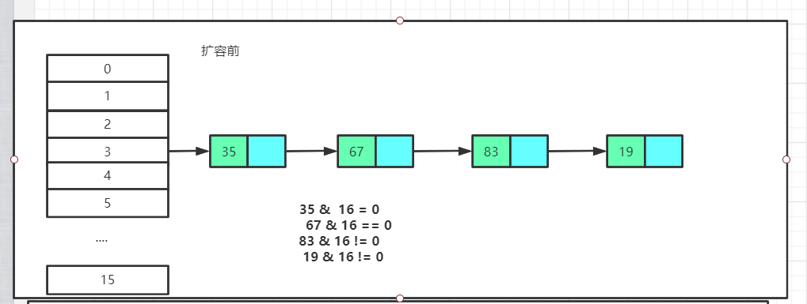
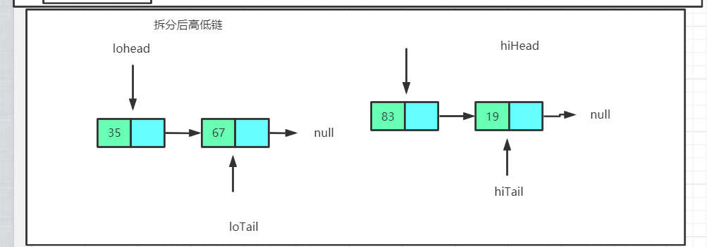
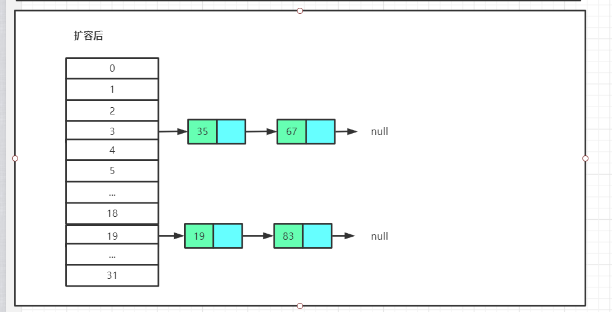
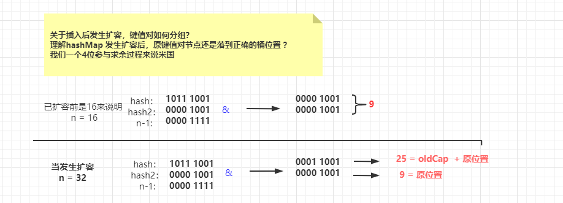

[TOC]

# 学习笔记

## HashMap 分析

### 概要

HashMap 是一个保存键和值映射关系的集合， 底层采用数组+链表（红黑树）数据结构

继承至`AbstractMap` ,实现勒`Serializable` , `Cloneable` ,`Map<K,V>` 接口，表明是可以序列化和扩容的。

线程不安全的，如果需要在高并发场景使用，可使用`ConcurrentHashMap`

允许null 键和 null 值， 键值的顺序不是存储的顺序。


### 基本原理 

HashMap 底层基于散列算法中的拉链法实现。 对于拉链算法，在进行CRUD 的时候，首先要定位元素所在的桶，

在通过链表查找元素 （所有在链表比较长的时候，查询效率就比较低，jdk1.8 引入红黑树）

比如我们要查询元素为3的数据，假设它的hash 是3

步骤为：

* 定位元素3 所在hash桶的位置
* 在3号桶指向链表查找元素3，在链表中遍历找到元素3.



原理就先分析到这，接下来开始分析源码


### 源码分析

> 本次分析JDK 版本为1.8 ， 大致分析hashMap 的查找，插入，构造函数，不涉及红黑树步骤。

#### 构造函数

##### 简要分析

HashMap常用的构造函数就两个， 主要是用来初始化一些全局变量，比如`loadFactor` ,`threshold`

这里没有涉及数组的初始化，数组的初始化延时到插入阶段。

介绍下构造函数用到的参数：

`initialCapacity` 初始容量，`threshold` 阈值，当键值对数据大于这个值就会发生扩容 , `loadFactor` 负载因子， 

```java
public HashMap() {
    this.loadFactor = DEFAULT_LOAD_FACTOR; // all other fields defaulted
}
public HashMap(int initialCapacity) {
    this(initialCapacity, DEFAULT_LOAD_FACTOR);
}

public HashMap(int initialCapacity, float loadFactor) {
    if (initialCapacity < 0)
        throw new IllegalArgumentException("Illegal initial capacity: " +
                                           initialCapacity);
    if (initialCapacity > MAXIMUM_CAPACITY)
        initialCapacity = MAXIMUM_CAPACITY;
    if (loadFactor <= 0 || Float.isNaN(loadFactor))
        throw new IllegalArgumentException("Illegal load factor: " +
                                           loadFactor);
    this.loadFactor = loadFactor;
    this.threshold = tableSizeFor(initialCapacity);
}

```

##### **tableSizeFor**

tableSizeFor 主要就是计算传入初始容量最接近的2次幂， 为什么是2次幂和后面定位桶优化有关。

```java
static final int tableSizeFor(int cap) {
    int n = cap - 1;
    n |= n >>> 1;
    n |= n >>> 2;
    n |= n >>> 4;
    n |= n >>> 8;
    n |= n >>> 16;
    return (n < 0) ? 1 : (n >= MAXIMUM_CAPACITY) ? MAXIMUM_CAPACITY : n + 1;
}
```


#### 查找（get）

##### 基本流程

> 查找步骤简要就理解分为两步 
>
> 1.计算hash 所在桶的位置
>
> 2.对链表或者红黑树进行查找

`tab[(n - 1) & hash]` 等价于`hash %  n` ,不用取模操作因为是因为位操作效率更高，后面会结合`hash函数` 一起说明为什么类似取余

```java
public V get(Object key) {
    Node<K,V> e;
    return (e = getNode(hash(key), key)) == null ? null : e.value;
}

//查找核心方法 
final Node<K,V> getNode(int hash, Object key) {
    Node<K,V>[] tab; Node<K,V> first, e; int n; K k;
    //计算hash在数据桶的位置，并拿到链表第一个元素 
    if ((tab = table) != null && (n = tab.length) > 0 &&
        (first = tab[(n - 1) & hash]) != null) {
        //检查第一个节点hash 值，key 和传入是否一致
        if (first.hash == hash && // always check first node
            ((k = first.key) == key || (key != null && key.equals(k))))
            return first;
        if ((e = first.next) != null) {
            //类型为红黑树，则使用红黑树方式查找
            if (first instanceof TreeNode)
                return ((TreeNode<K,V>)first).getTreeNode(hash, key);
            do {
                //遍历链表判断是否有于传入key 和 hash 相等的元素
                if (e.hash == hash &&
                    ((k = e.key) == key || (key != null && key.equals(k))))
                    return e;
            } while ((e = e.next) != null);
        }
    }
    return null;
}
```

##### **hash函数** 

从代码中可以看出就是对hashCode 进行`位运算`

>  为什么不直接使用元素的hashCode 方法？

1.因为数组长度一般不会特别大，我们定位桶采用`&`运算 (n -1 ) & hash， 数组默认容量是16，二进制就是10000，n -1 之后就是 1111。实际有效的就4位，于我们hashCode 取& 容易发生hash冲突。

int 占4字节，32位，前16位为高位 ，后16位尾低位， 通过无符号右移16位相当让高位参与运算，增加勒随机性，当我们长度大的时候，可以减少hash冲突。 

2.就是hashCode 方法可能被覆写，如果覆写的hashCode 分布的太紧凑，使用元素的hashCode 很容易发生hash碰撞。

```java
static final int hash(Object key) {
    int h;
    return (key == null) ? 0 : (h = key.hashCode()) ^ (h >>> 16);
}
```


##### 替换取`%`小操作

> 定位桶 （n -1 ） & hash  和 hash % n 的关系 

当n的长度为2次幂，我们能看到(n - 1 ) & hash 和 hash % n 的结果是一致，因为2^n次方-1 之后，二进制位全部变成1了，取& 的话就只会有存在1的部分参与运算




#### 插入（put）

##### 基本流程

> onlyIfAbsent 默认为false 。
>
> 插入步骤简单分为：
>
> 1.计算hash所在桶的位置，
>
> 2.判断桶中是否不存在元素，不存在则直接保存
>
> 3.桶中存在元素，先比较第一个元素与插入元素的key，hash是否相等，相等则可以更新键值。
>
> 4.当第一个元素不相等，向后遍历链表，判断是否有其他元素相等，遍历到队尾也没有相等元素，则
>
> 在队尾保存新节点。

`afterNodeAccess`,`afterNodeInsertion`两个方法留个linkedListHashMap做扩展的 

```java
public V put(K key, V value) {
    //定位key 所在桶的位置
    return putVal(hash(key), key, value, false, true);
}

final V putVal(int hash, K key, V value, boolean onlyIfAbsent,
               boolean evict) {
    Node<K,V>[] tab; Node<K,V> p; int n, i;
    //第一次插入会发生扩容 
    if ((tab = table) == null || (n = tab.length) == 0)
        n = (tab = resize()).length;
    //如果对应桶没有元素则直接插入 
    if ((p = tab[i = (n - 1) & hash]) == null)
        tab[i] = newNode(hash, key, value, null);
    else {
        Node<K,V> e; K k;
        if (p.hash == hash &&
            ((k = p.key) == key || (key != null && key.equals(k))))
            e = p;
        //如果节点是树节点采用树节点插入方式
        else if (p instanceof TreeNode)
            e = ((TreeNode<K,V>)p).putTreeVal(this, tab, hash, key, value);
        else {
            //遍历链表，并记录链表长度，for 自旋写法 
            for (int binCount = 0; ; ++binCount) {
                //遍历链表没有找到于插入相同的元素 ，在队尾保存该节点 
                if ((e = p.next) == null) {
                    p.next = newNode(hash, key, value, null);
                    //当链表长度为8就会链表转换为红黑树 
                    if (binCount >= TREEIFY_THRESHOLD - 1) // -1 for 1st
                        treeifyBin(tab, hash);
                    break;
                }
                if (e.hash == hash &&
                    ((k = e.key) == key || (key != null && key.equals(k))))
                    break;
                p = e;
            }
        }
        if (e != null) { // existing mapping for key
            V oldValue = e.value;
            if (!onlyIfAbsent || oldValue == null)
                e.value = value;
            afterNodeAccess(e);
            return oldValue;
        }
    }
    ++modCount;
    //如果map的元素超过阈值就发生扩容 
    if (++size > threshold)
        resize();
    afterNodeInsertion(evict);
    return null;
}

```

##### **resize()**

resize 的主要操作大概分为3步： 

1.计算容量和阈值 

2.扩容新数组

3.重新维护键值对桶的位置 （因为插入引起的容量不足）

**先分析 resize 第一步：**

先看最外层的**3个条件分支** 

第一分支`oldCap > 0` 当插入发生超过阈值时，判断扩容前如果大于等于Integer的最大值无法扩容，下面`(newCap = oldCap << 1) < MAXIMUM_CAPACITY &&oldCap >= DEFAULT_INITIAL_CAPACITY`

当扩容后大小不大于最大容量并且老的容量大于默认初始容量16，则两倍扩容，newThr = oldThr << 1 

可以理解为 oldThr * 2；

第二个分支`else if (oldThr > 0) `  首次插入的情况，在构造函数传入过初始容量，并计算过阈值，这里新的容量直接使用该阈值。

第三个分支 else ，首次插入默认构造函数newCap = 16， 阈值等于默认 负载因子 * 默认容量， `DEFAULT_LOAD_FACTOR * DEFAULT_INITIAL_CAPACITY` = 12;

```java

if (oldCap > 0) {}
else if (oldThr > 0) 
    // initial capacity was placed in threshold
else {               
    // zero initial threshold signifies using defaults
}

final Node<K,V>[] resize() {
        Node<K,V>[] oldTab = table;
        int oldCap = (oldTab == null) ? 0 : oldTab.length;
        int oldThr = threshold;
        int newCap, newThr = 0;
        if (oldCap > 0) {
            if (oldCap >= MAXIMUM_CAPACITY) {
                threshold = Integer.MAX_VALUE;
                return oldTab;
            }
            else if ((newCap = oldCap << 1) < MAXIMUM_CAPACITY &&
                     oldCap >= DEFAULT_INITIAL_CAPACITY)
                newThr = oldThr << 1; // double threshold
        }
        else if (oldThr > 0) // initial capacity was placed in threshold
            newCap = oldThr;
        else {               // zero initial threshold signifies using defaults
            newCap = DEFAULT_INITIAL_CAPACITY;
            newThr = (int)(DEFAULT_LOAD_FACTOR * DEFAULT_INITIAL_CAPACITY);
        }
        
   		//....... 省略
}
```

**resize 第二步**

创建一个新数组，容量为扩容后的大小，然后赋值给全局变量`table`

```java
Node<K,V>[] newTab = (Node<K,V>[])new Node[newCap]
table = newTab;
```

**resize 第三步 重新维护键值桶下标**

> 先理解一个概念就时 oldCap & hash == 0 不需要挪动位置，否者新位置 =  oldCap + 原位置 
>
> 这里把值等于0的称为低位链，不等于的称为高位链 
>
> 注意一个小细节， 这里区分高低位链 是 oldCap & hash是否等于0   和 我们定位桶 (n - 1) & hash 

```java
final Node<K,V>[] resize() {
    /
    //1.计算新的newThreshold 和 newCapacity
    threshold = newThr;
    //2.构建新容量数据并赋值给table
    
    //。。。。上述代码省略
    //3.重新维护键值对位置 
    //仅当插入后容量不足，需要扩容
    if (oldTab != null) {
        for (int j = 0; j < oldCap; ++j) {
            Node<K,V> e;
            if ((e = oldTab[j]) != null) {
                oldTab[j] = null;
                if (e.next == null)
                    newTab[e.hash & (newCap - 1)] = e;
                else if (e instanceof TreeNode)
                    ((TreeNode<K,V>)e).split(this, newTab, j, oldCap);
                else { // preserve order
                    Node<K,V> loHead = null, loTail = null;
                    Node<K,V> hiHead = null, hiTail = null;
                    Node<K,V> next;
                    do {
                        next = e.next;
                        if ((e.hash & oldCap) == 0) {
                            if (loTail == null)
                                loHead = e;
                            else
                                loTail.next = e;
                            //注意首次，loHead 和 loTail 同时指向 e
                            loTail = e;
                        }
                        else {
                            if (hiTail == null)
                                hiHead = e;
                            else
                                hiTail.next = e;
                            hiTail = e;
                        }
                    } while ((e = next) != null);
                    if (loTail != null) {
                        //让低位链队尾指向null，因为高位链已经放在高位链表中了 
                        loTail.next = null;
                        newTab[j] = loHead;
                    }
                    if (hiTail != null) {
                        hiTail.next = null;
                        //高位链 新位置 = oldCap + 原位置
                        newTab[j + oldCap] = hiHead;
                    }
                }
            }
        }
    }
    return newTab;
}
```

**图解高低链划分**

首先 `((e.hash & oldCap) == 0)` 表示低位链，否者高位链，以低位链为例，首先loHead 和 loTail 都指向元素e，然后依次寻找低位放在低位链的next， `loTail.next = e , loTail = e`, 相当于新节点时尾节点 

以35，67，83，19为例， 其中35，67 为低位链， 83，19为高位链



**拆分后高低位链** 



**设置高低位链到扩容数组**




**为什么可以需要拆分高低位链 ？ **

因为扩容后原链表定位的桶可能变化，低位链可以放在原位置，高位链需要挪动到oldCap + 原位置。

我们其实可以把维护键值对下标，看为一个插入动作，需求就是对于扩容前后元素hash到对应桶，在链表还是可以找到相应元素（不会出现扩容后元素找不到情况）

**为什么扩容低位链不移动，高位链oldCap +原位置？**

首先我们以n = 16 来说明，因为是2^次幂，如果 & 出来的结果是0，哪这个hash 的第5位一定不是 1，因为结果二次幂的就高位时1，其他全是0  ，所以扩容前和后对它都没有影响。

比如 0001 0000  和 hash 0000 1001  结果 == 0， 比如  1011 1001, 因为第5位有一个1，结果必然大于0

如果(oldCap & hash2) ！= 0 必然这个第5位上有1，也就是在**原来数的第5位加上一个1就是它的位置，也就是old + 原位置**




