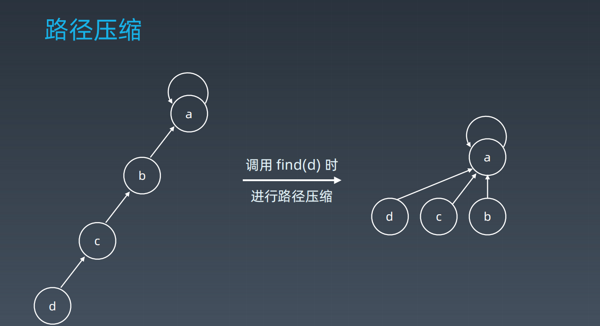

# 学习笔记

## Trie 树

> Trie 树也称为字典树 或前缀树
>
> 可应用统计和排序大量字符串（不仅限字符串），搜索补全
>
> 节点可以存储额外信息，比如访问字典的次数

### 基本性质

* 结点本身不存完整的单词
* 从根节点到某一叶子结点，所走路径则为该结点字符串（前缀树）
* 每个结点的所有子节点路径代表字符一定不同

### 内部实现

> 以数组为例 


### 核心思想

Tire 的核心思想就是空间换时间 

利用字符串的公共前缀来降低查询时间的开销以达到提高效率的目的。

**优点**：最大限度减少无谓字符串比较，查询效率比哈希表高


### 代码模板

```java
public class Trie{
	// 抽象数据结构 ，成员属性， 是否单词结束 Boolean isEnd, TrieNode[] next; 
    // 操作 插入，搜索指定字符串是否在Trie 树中， 搜索前缀是否存在 
    private TrieNode root;
    
    public Trie() {
        root = new TrieNode();
    }
    
    public void insert(String word) {
        if (word == null || word.length() == 0) {return;}
        TrieNode cur = root;
        for (int i = 0; i < word.length(); i++) {
            int n = word.charAt(i) - 'a';
            if (cur.next[n] == null) {cur.next[n] = new TrieNode();}
            cur = cur.next[n];
        }
        cur.isEnd = true;
    }
    
    public boolean search(String word) {
    	TrieNode node = searchPrefix(word);
        return node != null && node.isEnd;
    }
    
    public boolean searchPrefix(String prefix) {
        TrieNode node = searchPrefix(prefix);
        return node != null;
    }
    private TrieNode searchPrefix(String word) {
        TrieNode node = root;
        for (int i = 0; i < word.length(); i++) {
            if (node.next[word.charAt(i) - 'a'] == null) {return null;}
            node = node.next[word.charAt(i) - 'a'];
        }
        return node;
    }
    
    
    
	
    private class TrieNode {
        private boolean isEnd;
        private TrieNode[] next;
        public TrieNode() {
            this.isEnd = false;
            this.next = new TrieNode[26];
        }
    }
    
}
```


### 单词搜索II 的 复杂度分析： 

使用Trie 树能够尽早的知道给定的单词是否在网格中

实现分为 初始化Trie ， 插入单词列表到Trie 中， 遍历二维网格 进行dfs 

复杂度可以拆解为 遍历二维网格每个点 * dfs 的复杂度

我们就分析dfs 的复杂度， 假设L 为字符串最大长度， 极端情况，每个点都可以上下左右扩散（周围都是相同字符且有效）， 转换求单个方向复杂度  ，单个方向可向3个方向搜索（除掉刚过来的方向），每个方向就有 L -1 次方，三个方向就是 3 ^ L -1,  回溯的情况就是为3 ^ L -1 ，然后最初节点可以从4个方向搜索, * 二维网格

复杂度 = O （m * n * 4 * 3 ^ L -1）


## 图

### 存储结果

* 邻接矩阵
  * 采用二维数组存储
  * 邻接矩阵主对角线为0，行存储顶点，列存储行所指向顶点是否有边
* 邻接表
  * 采用数组 + 链表存储方式 
* 比较 邻接表适合**边比较少**的情况，因为当边不多，采用二维数组存储会浪费很多空间


### 遍历方式

#### 搜索 - 遍历

* 每个节点都要访问一次
* 每个节点仅访问一次
* 对于节点访问顺序不同分为
  * 深度优先遍历 （depth first search）
  * 广度优先遍历（breadth first search）

> 图的遍历一定需要有visited 保证每个节点仅访问一次

**深度遍历**

```java
//图的深度遍历
// 方法参数 一个二维数组存储边集合， 当前的顶点， 访问数据， 打印或者保存到结果中 
List<Integer> result = new ArrayList<>();
public void dfs(int[][] m, int v, boolean[] visited) {
    visited[v] = true;
    result.add(v);
    for (int col = 0; col < m.length; col++) {
        //存在邻接点并且 没有被访问过 
        if (m[v][col] == 1 && visited[col] == false) {
            dfs(m,col, visited);
        }
    }
}
```


**广度遍历模板**

```java
//图的广度遍历
// 方法参数  一个二维数组（适合边比较多的情况）， 当前顶点，
//在实例中获取当前节点就存在当前节点邻接点数字
List<Integer> result = new ArrayList<>();
public void bfs(int[][] m,int v) {
    boolean[] visited  = new boolean[m.length];
    Queue<Integer> queue = new LinkedList<>();
    result.add(v);
    visited[v] = true;
    queue.offer(v);
    while (!queue.isEmpty()) {
        Integer s =  queue.poll();
        for (int i = 0; i < m.length; i++) {
            if (m[s][i] == 1 && visited[i] == false) {
                visited.add(i);
                result.add(v);
                queue.offer(v);
            }
        }
    }
}
```


## 并查集

> 主要是解决图论中的【动态连通性】问题
>
>  并查集解决组团，配对问题
>
> 常见的社交网络朋友圈

### 基本操作

* makeSet(s)  建立一个新的并查集， 其中包含s 格单元素集合（或者说s 的每个元素都是一棵树）
* unionSet(x, y ) 把元素x 和 元素y 所在的集合合并， 要求x 和 y 所在的集合不相交， 如果相交则不合并
* find(x) 找到元素x 所在的集合的代表， 该操作也可以用于判断两个元素是否位于同一个集合，将各自的根节点比较是否相等

#### 初始化 makeSet 


#### 查询，合并


#### 路径压缩




代码模板

```java
public class UnionFind {
    //抽象数据结构 成员变量  int count 连通分量 int[] parnet 节点x 的parnet[x]
    //操作 初始化 ，  合并， 查找节点的根节点
    private int count;
    private int[] parent;
    
    public UnionFind(int n) {
        this.count = n;
        this.parent = new int[n];
        for (int i = 0; i < n; i++) {
            parent[i] = i;
        }
    }
    
    public int find(int p) {
        if (parent[p] == p) {
            return p;
        }
        parent[p] = find(parent[p]);
        return parent[p];
    }
    
    public void union(int p, int q){
        int rootP = find(p);
        int rootQ = find(q);
        if (rootP == rootQ) {return;}
        parent[rootP] = rootQ;
        count--;
    }
}
```


### 相关题目

- [朋友圈](https://leetcode-cn.com/problems/friend-circles)（亚马逊、Facebook、字节跳动在半年内面试中考过）
- [岛屿数量](https://leetcode-cn.com/problems/number-of-islands/)（近半年内，亚马逊在面试中考查此题达到 361 次）
- [被围绕的区域](https://leetcode-cn.com/problems/surrounded-regions/)（亚马逊、eBay、谷歌在半年内面试中考过）


